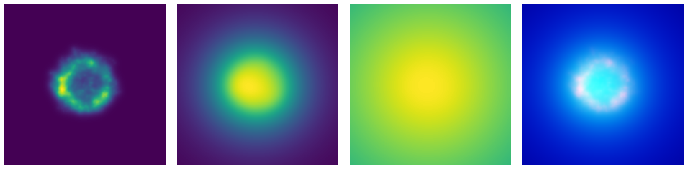
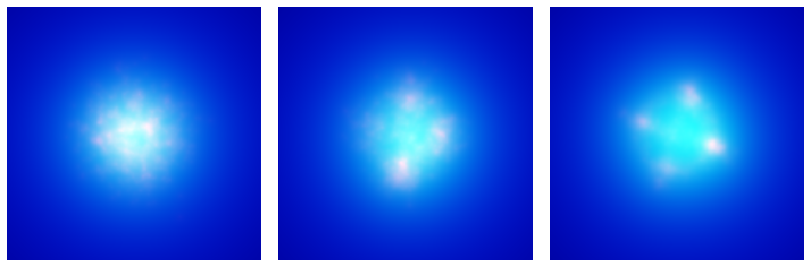
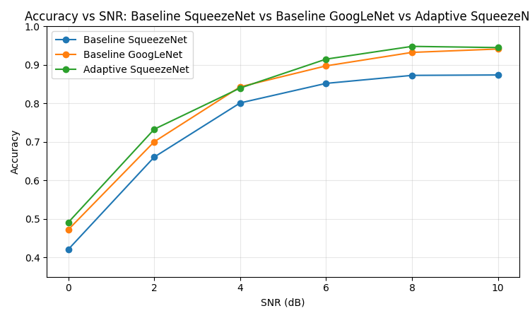
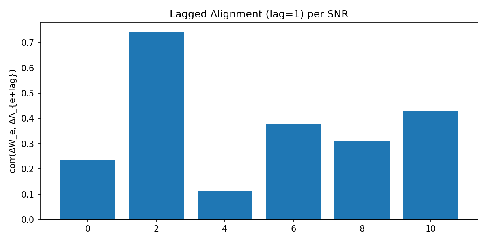

# Adaptive Sampling for Automatic Modulation Classification

Deep learning-based automatic modulation classification using constellation diagram images. This project reproduces baselines from academic literature and introduces an **adaptive sampling method** that dynamically adjusts the training distribution to focus on difficult (class, SNR) regions.

## Overview

Constellation-diagram CNNs achieve high accuracy at moderate/high SNRs but degrade sharply at low SNR (0–2 dB). This project addresses that limitation through adaptive sampling—a closed-loop training process where the model's per-bucket errors directly influence future sampling decisions.

**Key finding:** Adaptive sampling allows a compact SqueezeNet model to match or surpass the InceptionV3 baseline at low SNRs, demonstrating that modifying the training distribution can be as impactful as modifying the architecture.

## Constellation-to-Image Conversion

Raw I/Q samples are converted to 224×224 RGB images using exponential decay kernels at three scales:

| Channel | α | Captures |
|---------|---|----------|
| R | 10.0 | Sharp, localized constellation clusters |
| G | 1.0 | Intra-cluster structure, medium-range density |
| B | 0.1 | Global density and energy spread under noise |


*Figure 1: Multi-scale constellation representation (R, G, B channels and combined image).*

This multi-scale representation provides complementary spatial views and is robust to noise at low SNR where raw constellations collapse.

## Dataset

Based on **RadioML 2018.01A** with 8 modulation classes:
- BPSK, QPSK, OQPSK, 8PSK, 4ASK, 16QAM, 32QAM, 64QAM

SNR levels: 0, 2, 4, 6, 8, 10 dB


*Figure 2: QPSK constellation at varying SNR levels (0, 4, and 10 dB), demonstrating degradation of signal structure with increasing noise.*

~22,000 images per class (90% train / 10% validation split).

## Results

### Baseline Performance

| SNR (dB) | InceptionV3 (Peng) | SqueezeNet (Chahil) |
|----------|-------------------|---------------------|
| 0 | 47.25% | 42.12% |
| 2 | 70.06% | 66.09% |
| 4 | 84.31% | 80.13% |
| 6 | 89.75% | 85.21% |
| 8 | 93.25% | 87.28% |
| 10 | 94.13% | 87.39% |

SqueezeNet trails InceptionV3 by ~5–7 points, as expected for a lightweight model.

### Adaptive SqueezeNet Performance


*Figure 3: Adaptive SqueezeNet (green) catches up to the InceptionV3 baseline (orange) at low SNRs, significantly outperforming the standard SqueezeNet (blue).*

| SNR (dB) | Baseline | Adaptive | Δ |
|----------|----------|----------|---|
| 0 | 42.12% | **49.13%** | +7.0 |
| 2 | 66.09% | **73.31%** | +7.2 |
| 4 | 80.13% | **84.00%** | +3.9 |
| 6 | 85.21% | **91.50%** | +6.3 |
| 8 | 87.28% | **94.81%** | +7.5 |
| 10 | 87.39% | **94.50%** | +7.1 |

**Adaptive SqueezeNet matches or surpasses InceptionV3 despite being far smaller.**

## Adaptive Sampling Method

Training samples are organized into 48 buckets (8 classes × 6 SNRs). After each epoch:

1. Compute per-SNR validation accuracy
2. Convert to error: `e(b) = 1 - accuracy(b)`
3. Generate target distribution proportional to error
4. Update weights via exponential smoothing: `w' = (1-β)w + β·target`
5. Apply stability constraints (floor, cap), renormalize

### Stabilization Mechanisms
- **Warmup**: First 3 epochs use uniform sampling
- **Accuracy gate**: Updates only when val accuracy > 15%
- **Weight floor**: ε = 10⁻⁴ prevents bucket starvation
- **Weight cap**: No bucket exceeds 40%
- **Replay fraction**: 10% uniform samples to avoid forgetting

### Why It Works

*Figure 4: Lag-1 Alignment Between ∆Weight and ∆Accuracy - shows increasing bucket weight at epoch t improves accuracy at t+1*

Lag-1 correlation analysis shows increasing bucket weight at epoch t improves accuracy at t+1:
- 2 dB: +0.742 correlation
- 10 dB: +0.430
- 6 dB: +0.376
- 0 dB: +0.236

Weight increases translate into subsequent learning gains.

## Project Structure

```
src/
├── common/                    # Shared utilities
│   ├── squeezenet.py          # SqueezeNet v1.1 architecture
│   ├── image_generator.py     # I/Q → constellation image conversion
│   └── preprocess.py          # Dataset preprocessing
├── adaptive_sampling/         # Adaptive sampling implementation
│   ├── sampler.py             # Bucket sampling logic
│   ├── callbacks_confusion_snr.py  # Per-SNR weight updates
│   └── train_squeezenet_sampler.py
├── baseline_chahil/           # SqueezeNet baseline
└── baseline_peng/             # InceptionV3 baseline
```

## Setup

### Docker (recommended)
```bash
docker build -t deep-amc .
docker run --gpus all -it -v $(pwd):/app deep-amc bash
```

Containerization was essential—campus GPU servers had mismatched CUDA/driver versions causing TensorFlow to fall back to CPU or crash.

### Dataset
Download RadioML 2018.01A, then:
```bash
python src/common/preprocess.py
python src/adaptive_sampling/dataset_metadata.py
```

## Training

```bash
# InceptionV3 baseline (Peng et al.)
python src/baseline_peng/train_inceptionv3.py

# SqueezeNet baseline (Chahil et al.)
python src/baseline_chahil/train_squeezenet.py

# Adaptive SqueezeNet
python src/adaptive_sampling/train_squeezenet_sampler.py \
    --mode adaptive \
    --sampler-backend tfdata \
    --warmup-epochs 3 \
    --resample-each-epoch
```

## Conclusion

Training-distribution shaping is a simple, architecture-independent technique that substantially improves AMC robustness, especially for lightweight models. The adaptive framework shows that learning-based sampling strategies can complement or even outperform architectural modifications when addressing low-SNR classification challenges.

## Ongoing & Future Work

This project is currently being extended towards a physical, real-time implementation to validate the adaptive sampling benefits in hardware.

* **FPGA Acceleration:** Porting the trained SqueezeNet model to an FPGA target to demonstrate low-latency inference.
* **Model Optimization:** Implementing quantization and pruning to fit the adaptive model onto embedded logic resources while maintaining the accuracy gains achieved at low SNR.
* **End-to-End System:** The long-term goal is combining the adaptive sampling framework with efficient hardware inference to create a practical, real-time AMC system for edge devices.

## References

1. Peng et al. (2019) - "Modulation classification based on signal constellation diagrams and deep learning," IEEE TNNLS
2. Chahil et al. (2024) - "Performance analysis of different signal representations and optimizers for CNN based automatic modulation classification," Wireless Personal Communications
3. O'Shea et al. (2018) - "Over-the-air deep learning based radio signal classification," IEEE JSTSP (RadioML dataset)
